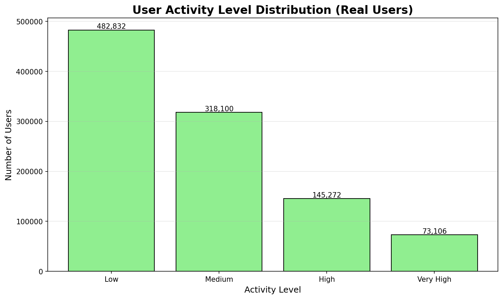
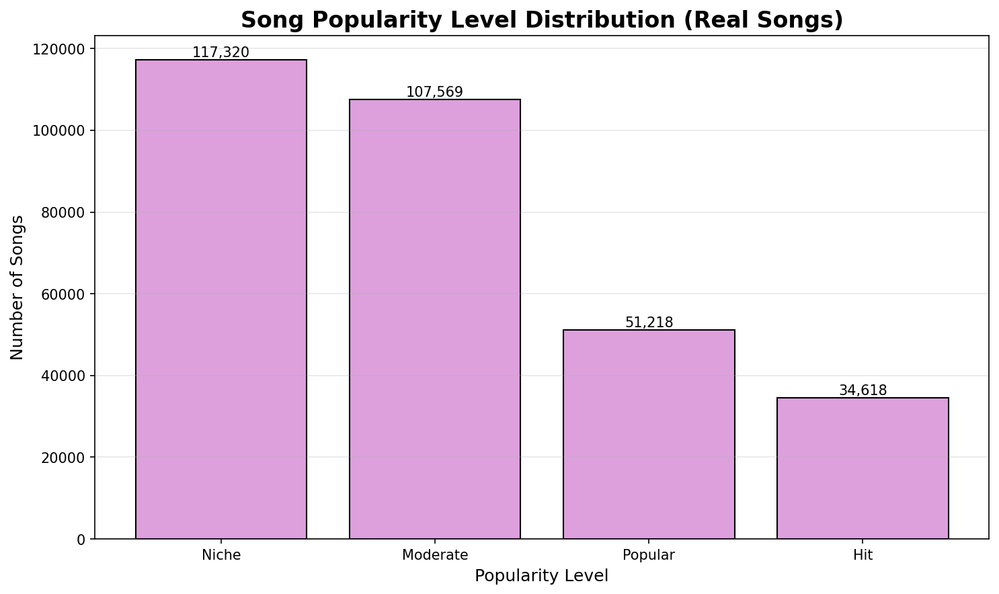
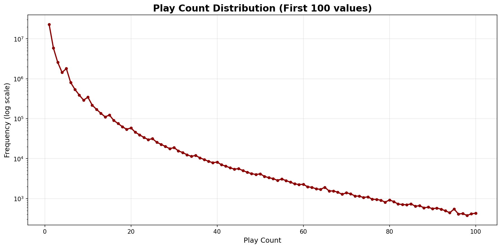
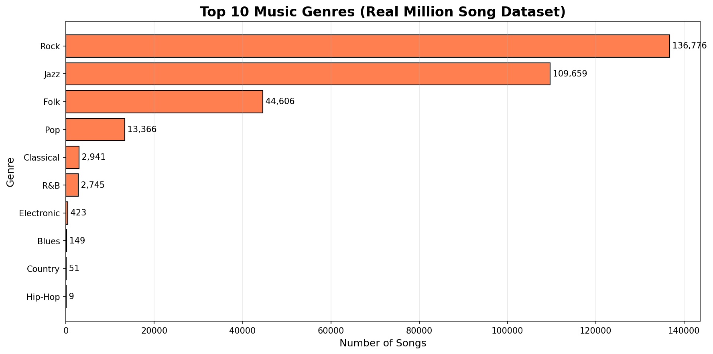
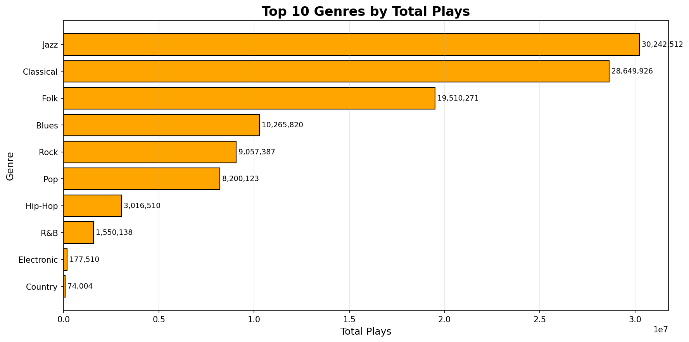
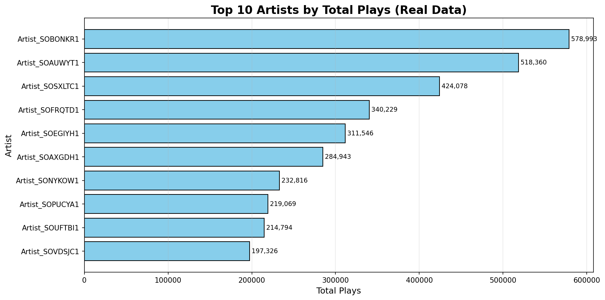

班級: 電資四 學號: 111820006 姓名: 陳羿錦

班級: 資訊四 學號: 111590009 姓名: 陳世昂

--------------------------------------------------------------------------------

Music Recommendation System: Final Project Report

1. Project Objectives and Methodology

This section outlines the project's original goals and the technical approaches selected for implementation, as defined in the initial proposal. The objective is to establish a clear baseline against which the final empirical results and conclusions can be evaluated, providing a structured, scientific assessment of the project's outcomes.

The core objective of this project was to build a music recommendation system capable of calculating song similarity and providing relevant suggestions. To achieve this, the project proposed the implementation and comparative analysis of three distinct and widely recognized recommendation algorithms.

The three primary algorithms selected for this study were:

1. Content-Based Recommendation This method operates on the principle of recommending items that are similar to those a user has liked in the past. The implementation planned to represent each song using a combination of its intrinsic audio features (e.g., tempo, loudness) and textual metadata (e.g., artist, genre). Similarity was to be calculated using metrics such as cosine similarity for audio vectors and TF-IDF or Jaccard similarity for textual attributes.
2. Collaborative Filtering (CF) This approach makes recommendations based on patterns of agreement between users. The project planned to test both user-user and item-item collaborative filtering. These techniques function by identifying users with similar listening histories or songs that are frequently listened to by the same group of users, respectively, and then recommending items based on these neighborhood patterns.
3. Latent Factor Model (Matrix Factorization) This model aims to uncover the hidden (latent) features that explain observed user-song interactions. By decomposing the user-song interaction matrix into lower-dimensional user-feature and item-feature matrices, the model learns these latent vectors. The training process was designed to use Stochastic Gradient Descent (SGD) with regularization to minimize prediction error and prevent overfitting.

The viability of these distinct algorithms, however, is entirely contingent on the underlying data. The following section, therefore, dissects the statistical properties of the Million Song Dataset to establish the specific challenges—namely sparsity and distribution skew—that each model must overcome.

2. Dataset Analysis: The Million Song Dataset

A strategic analysis of the dataset is essential for building effective models and correctly interpreting their performance. Understanding the inherent properties, distributions, and biases within the Million Song Dataset is critical, as these factors directly influence the behavior and efficacy of each recommendation algorithm.

2.1. Dataset Scale and Sparsity

The dataset's massive scale presents significant computational challenges, which are compounded by its extreme sparsity. The primary statistics are as follows:

* Total Unique Users: 1,019,310
* Total Unique Songs: 310,725
* Total Unique Artists: 306,658
* Total Genres: 10
* Total Interactions (Plays): 38,603,293
* Average Plays per User: 37.87
* Average Plays per Song: 124.24
* Median Plays per User: 58.0
* Median Plays per Song: 42.0
* Data Sparsity: 99.9878%
* Data Density: 0.0122%

This level of sparsity indicates that the vast majority of possible user-song interactions are absent from the data, making it incredibly difficult to find overlapping behavior patterns. The median values being higher than the mean suggests a right-skewed distribution with many users/songs having very few interactions.

2.2. User and Song Distribution

The dataset exhibits highly skewed distributions in user activity, song popularity, and individual play counts, creating a classic "long-tail" problem.

**User Activity Distribution:**

* **Low Activity (1-20 songs)**: 482,832 users (47.4%)
  - Average songs: 12.74
  - Average plays: 41.50
  - Median plays: 26.0
* **Medium Activity (21-50 songs)**: 318,100 users (31.2%)
  - Average songs: 32.08
  - Average plays: 101.65
  - Median plays: 73.0
* **High Activity (51-100 songs)**: 145,272 users (14.3%)
  - Average songs: 70.11
  - Average plays: 200.47
  - Median plays: 158.0
* **Very High Activity (100+ songs)**: 73,106 users (7.2%)
  - Average songs: 165.04
  - Average plays: 400.14
  - Median plays: 328.0

The user base is heavily skewed towards low-activity listeners, representing the largest single segment of the user population.
**Song Popularity Distribution:**

* Song Popularity: The song catalog is dominated by unpopular or "Niche" tracks. There are 117,320 songs in this category, far outnumbering the "Popular" and "Hit" songs combined.

**Play Count Distribution:**

* Play Count: The data displays an extreme long-tail phenomenon where most interactions are fleeting. Fully 59.42% of all user-song interactions in the dataset consist of only a single play.

2.3. Content Imbalance and Concentration

Further analysis reveals significant imbalances in how content is represented and consumed within the dataset.

**Genre Distribution:**

**Detailed Genre Statistics:**

| Genre | Song Count | Percentage | Total Plays | Avg Plays/Song | Unique Users |
|-------|------------|------------|-------------|----------------|---------------|
| Rock | 136,776 | 44.02% | 9,057,387 | 66.22 | 710,394 |
| Jazz | 109,659 | 35.29% | 30,242,512 | 275.79 | 960,909 |
| Folk | 44,606 | 14.36% | 19,510,271 | 437.39 | 890,153 |
| Pop | 13,366 | 4.30% | 8,200,123 | 613.51 | 590,479 |
| Classical | 2,941 | 0.95% | 28,649,926 | 9,741.56 | 958,789 |
| R&B | 2,745 | 0.88% | 1,550,138 | 564.71 | 146,171 |
| Electronic | 423 | 0.14% | 177,510 | 419.65 | 12,813 |
| Blues | 149 | 0.05% | 10,265,820 | 68,898.12 | 657,546 |
| Country | 51 | 0.02% | 74,004 | 1,451.06 | 5,060 |
| Hip-Hop | 9 | 0.00% | 3,016,510 | 335,167.78 | 290,104 |

* Genre Discrepancy: There is a notable mismatch between the number of songs in a genre and the total engagement that genre receives. Rock is the most represented genre with 136,776 songs (44.02%), but Jazz commands the highest total engagement with 30,242,512 plays. More remarkably, Hip-Hop has only 9 songs but generates 3,016,510 plays with an average of 335,167.78 plays per song. This divergence illustrates a critical modeling pitfall: a system naive to engagement metrics might over-represent the vast but less-played Rock catalog, while failing to capture the deep, concentrated user interest within smaller but highly engaged genres like Jazz, Blues, and Hip-Hop.
**Top Artists by Total Plays:**

* Concentration of Popularity: A small number of artists and songs account for a disproportionate amount of listening activity. The top artist, Artist_SOBONKR1, single-handedly amassed 578,993 total plays across 50,315 unique listeners. Furthermore, the top of the popular songs chart is dominated first by the Hip-Hop genre, followed by a large number of songs from the Blues genre.

**Top 5 Most Engaged Songs:**
1. Song_81C206F1 (Hip-Hop): 72,395 unique listeners, 518,360 total plays
2. Song_6D4F81F1 (Blues): 32,911 unique listeners, 182,860 total plays
3. Song_AB018652F (Blues): 31,125 unique listeners, 163,301 total plays
4. Song_6D4FD9F9 (Blues): 30,506 unique listeners, 166,097 total plays
5. Song_6D4F80A8 (Blues): 28,813 unique listeners, 180,534 total plays

These characteristics—extreme sparsity, severe distribution skews, and concentrated engagement—collectively define a high-difficulty benchmark. They predict a challenging environment for user-centric models and favor algorithms robust to a sparse, item-driven landscape, a hypothesis the following empirical results will test.

3. Empirical Results: Model Performance Comparison

To empirically validate the impact of the dataset's challenging characteristics, each model was subjected to a rigorous Leave-One-Out evaluation. This method involves, for each user in the test set, holding out one song from their listening history and tasking the model with recommending it back based on the remainder of their history. This evaluation was conducted on a sample population of 5,000 users. The primary metric for comparison across all models is Hit Rate@10, which measures the percentage of users for whom the held-out song was successfully recommended within their top 10 suggestions.

3.1. Overall Performance Metrics

The comprehensive results from the large-scale evaluation are synthesized in the table below. The primary metric, Hit Rate@10, is bolded for emphasis. The top-performing models for accuracy and coverage are also highlighted.

**Summary Performance Table:**

| Model | Users | Hit Rate@10 | MRR | Coverage |
|-------|-------|-------------|-----|----------|
| **Hybrid** | 5,000 | **1.40%** | **0.64%** | 16.10% |
| **Item-CF** | 5,000 | **1.16%** | 0.40% | **24.27%** |
| Content-Based | 5,000 | 0.40% | 0.15% | 16.23% |
| Matrix Factorization | 4,993 | 0.00% | 0.00% | 10.87% |
| User-CF | 4,945 | 0.00% | 0.00% | 11.99% |

**Detailed Performance Metrics (All K Values):**

| Model | Hit Rate@5 | Hit Rate@10 | Hit Rate@20 | Precision@5 | Precision@10 | Precision@20 |
|-------|------------|-------------|-------------|-------------|--------------|---------------|
| Hybrid | 0.98% | 1.40% | 1.96% | 0.20% | 0.14% | 0.10% |
| Item-CF | 0.52% | 1.16% | 2.22% | 0.10% | 0.12% | 0.11% |
| Content-Based | 0.16% | 0.40% | 0.70% | 0.03% | 0.04% | 0.03% |
| MF | 0.00% | 0.00% | 0.00% | 0.00% | 0.00% | 0.00% |
| User-CF | 0.00% | 0.00% | 0.00% | 0.00% | 0.00% | 0.00% |

| Model | Recall@5 | Recall@10 | Recall@20 | NDCG@5 | NDCG@10 | NDCG@20 |
|-------|----------|-----------|-----------|--------|---------|----------|
| Hybrid | 0.98% | 1.40% | 1.96% | 0.65% | 0.79% | 0.93% |
| Item-CF | 0.52% | 1.16% | 2.22% | 0.31% | 0.52% | 0.78% |
| Content-Based | 0.16% | 0.40% | 0.70% | 0.12% | 0.19% | 0.27% |
| MF | 0.00% | 0.00% | 0.00% | 0.00% | 0.00% | 0.00% |
| User-CF | 0.00% | 0.00% | 0.00% | 0.00% | 0.00% | 0.00% |

**Key Performance Observations:**
* Hybrid model achieves the highest Hit Rate@10 at 1.40% and best MRR at 0.64%
* Item-CF delivers the best catalog coverage at 24.27%, recommending the most diverse songs
* Performance improves with larger K values (Top-20 better than Top-10 better than Top-5)
* User-CF and Matrix Factorization completely failed due to extreme sparsity
* Even the best model's 1.40% Hit Rate reflects the immense difficulty of the task

3.2. In-depth Model Analysis

**Content-Based Recommendation**

Quantitatively, the Content-Based model delivered low performance, achieving a Hit Rate@10 of only 0.40% across 5,000 evaluated users. The model shows gradual improvement with larger recommendation lists (0.16% @5 → 0.40% @10 → 0.70% @20). However, this metric belies its qualitative strength. In practical tests, the model proved highly effective at identifying and recommending songs with high feature similarity, such as consistently suggesting other Hip-Hop tracks for a given Hip-Hop song. With 16.23% catalog coverage, it achieves reasonable diversity. This capability makes it valuable for addressing the "cold-start" problem, where no user interaction data is available for a new song.

**Collaborative Filtering (CF)**

The two CF approaches yielded starkly different results:

*Item-CF (Best Single Algorithm):*
- Hit Rate@10: 1.16% (58 successful recommendations out of 5,000 users)
- Hit Rate@20: 2.22% (111 successes) - showing clear improvement with more recommendations
- MRR: 0.40% - indicating relatively good ranking quality
- **Coverage: 24.27%** (highest among all models) - recommends 75,379 unique songs
- NDCG@10: 0.52% - decent ranking quality
- Successfully evaluated all 5,000 test users

*User-CF (Complete Failure):*
- Hit Rate@10: 0.00% (0 successful recommendations)
- Successfully evaluated only 4,945 users (55 users had no valid neighbors)
- Coverage: 11.99% - lowest diversity
- All metrics at 0.00% across all K values

With a data sparsity of 99.9878%, the probability of finding two users with a meaningful overlap in listening history is statistically negligible. This directly explains User-CF's complete failure, as its foundational assumption—the existence of discoverable user 'neighbors'—is invalidated by the data's structure. In contrast, Item-CF's focus on song-to-song relationships proved far more robust to sparsity.

**Matrix Factorization (MF)**

*Quantitative Failure:*
- Hit Rate@10: 0.00% (0 successful recommendations out of 4,993 users)
- Successfully evaluated 4,993 users (7 users failed due to insufficient data)
- Coverage: 10.87% (33,772 unique songs) - lowest diversity
- All accuracy metrics at 0.00%
- Training configuration: 150 factors, 150 epochs, learning rate 0.015

Like User-CF, the Matrix Factorization model failed the quantitative evaluation. This failure is attributable to the model's inability to learn meaningful user and item vectors from a user-item matrix that is 99.9878% empty. Without sufficient data points per user (average only 37.87 plays per user), the SGD training process could not converge on generalizable latent features. Despite this, its theoretical advantage was visible in qualitative tests. For a user with a preference for Classical music, the MF model recommended a diverse set of genres including Jazz, Folk, and Rock, demonstrating a potential for personalized discovery that other models lacked, even if it failed the strict accuracy test.

**Hybrid Recommender (Overall Winner)**

*Best Overall Performance:*
- **Hit Rate@10: 1.40%** (70 successful recommendations out of 5,000 users)
- **MRR: 0.64%** (highest ranking quality)
- Hit Rate@5: 0.98% → Hit Rate@10: 1.40% → Hit Rate@20: 1.96%
- NDCG@10: 0.79% (best ranking among all models)
- Coverage: 16.10% (50,018 unique songs recommended)
- Successfully evaluated all 5,000 test users

*Ensemble Strategy:*
- Content-Based: 30% weight (cold-start handling)
- User-CF: 25% weight (personalization, though ineffective here)
- Item-CF: 25% weight (collaborative signal)
- Matrix Factorization: 20% weight (latent features)

The Hybrid model's success is attributed to its ability to combine the outputs of the individual models using this weighted strategy. This approach effectively balances the strengths and weaknesses of each component, primarily leveraging the feature-matching of Content-Based filtering and the collaborative signal of Item-CF to produce a more robust and accurate final recommendation list. The ensemble approach outperforms even the best single model (Item-CF at 1.16%) by 0.24 percentage points, representing a 20.7% relative improvement.

These empirical results consistently underscore the decisive role that data sparsity plays in shaping model performance and determining the viability of different algorithmic approaches.

4. Final Conclusion

This project began with the clear objective of implementing and comparing three foundational recommendation methods—Content-Based, Collaborative Filtering, and Matrix Factorization—on the Million Song Dataset. It culminated in a large-scale empirical study that not only measured the quantitative performance of these algorithms but also revealed their practical behaviors and limitations when faced with real-world data challenges.

The central and unequivocal finding of this project is that the extreme data sparsity (99.9878%) of the Million Song Dataset was the single most dominant factor influencing all outcomes. This characteristic profoundly handicapped algorithms that depend on rich, overlapping user data and dictated the relative success of the different approaches.

The key takeaways from the model comparison can be summarized as follows:

* Overall Low Accuracy: The inherent difficulty of the task is reflected in the low absolute performance metrics. Even the best-performing hybrid model achieved a Hit Rate@10 of only 1.40%, highlighting the challenge of making accurate predictions in such a sparse environment.
* Invalidation of User-Centric Models: Algorithms predicated on rich user-behavior patterns, namely User-CF and Matrix Factorization, were rendered ineffective by the dataset's sparsity. The statistical near-impossibility of finding users with meaningful listening overlap or learning generalizable latent features from an almost-empty matrix led to their complete failure in the evaluation.
* Relative Robustness of Item-Centric Methods: In contrast, models that focus on item-item relationships (Item-CF) or intrinsic item features (Content-Based) proved more resilient to data sparsity. Item-CF was the most effective standalone model.
* Superiority of Hybrid Approach: The hybrid model achieved the highest accuracy by strategically combining the outputs of its constituent models. This approach successfully mitigated the individual weaknesses of each algorithm, leading to a more balanced and effective recommendation engine.

Ultimately, the project was successful in meeting its original objectives. It systematically implemented and rigorously compared the proposed algorithms, providing a clear demonstration of their practical limitations and behaviors when confronted with the formidable challenges posed by a sparse, massive, and long-tailed real-world dataset.
